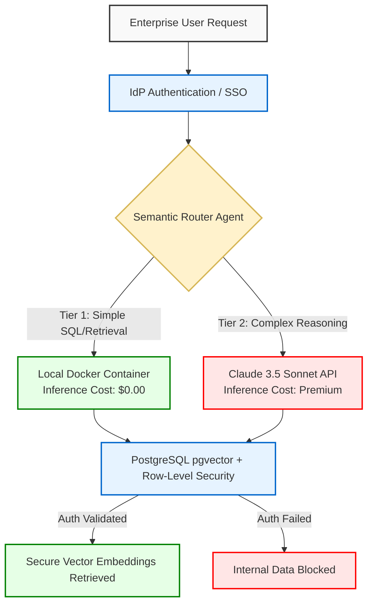

# System Design: Semantic Routing & RLS Data Governance

## 1. Cost-Optimized Semantic Routing
Not all queries require the reasoning capabilities of frontier models. Sending simple data retrieval requests to premium models causes unnecessary token bloat.

**Architecture:**
An AI Agent acts as the front-line traffic controller:
*   **Tier 1 (Fast/Free):** If a user asks for a standard metric (e.g., "Pull last month's delivery KPIs"), the Agent utilizes a Python-driven SQL lookup or routes to a locally hosted, containerized model.
*   **Tier 2 (Premium/Complex):** If a user requires complex reasoning or synthesis (e.g., "Analyze these three system architecture proposals and identify security flaws"), the Agent specifically routes the prompt to Claude. This ensures the expensive Claude API is only invoked when its advanced reasoning capabilities are financially justified.

## 2. Row-Level Security (RLS) Governance
Enterprise search tools present a massive risk of internal data leakage. An AI cannot be allowed to hallucinate or accidentally retrieve restricted executive documents.

**Architecture:**
We leverage foundational relational database security within the vector store. Using PostgreSQL with the `pgvector` extension, we implement strict SQL Row-Level Security (RLS) policies. 
*   Before the vector database returns semantic search results to the LLM context window, the RLS policy validates the querying user's Identity Provider (IdP) credentials.
*   The system filters out any vector embeddings the user does not have explicit permission to view, ensuring 100% data isolation at the bare-metal database tier before the AI ever sees the data.

