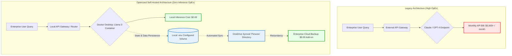

# Architecture Decision Record (ADR): AI FinOps & Self-Hosted Infrastructure

## Executive Summary
Enterprise reliance on managed AI API endpoints (e.g., OpenAI Enterprise) creates unsustainable, variable OpEx scaling as token consumption grows. This document outlines the FinOps strategy for migrating non-reasoning-heavy RAG workloads to a containerized, self-hosted infrastructure.

## Business Problem
At scale, processing 5 million tokens daily through managed SaaS LLMs generates thousands of dollars in monthly recurring cloud fees. Furthermore, transmitting proprietary operational data to external API endpoints introduces latency and compliance risks.

## Architectural Solution: Containerized Local Deployment
To eliminate SaaS subscription fees and control infrastructure costs, we deploy open-source models (e.g., Llama 3) locally via Docker Desktop environments.

### Storage & Resilience Architecture
A primary concern with local containerization is data persistence and disaster recovery. Instead of relying on vulnerable default local volumes, the system architecture dictates modifying the `.env` file configurations to route the active container storage directories directly into a OneDrive-synced folder path (e.g., routing `UPLOAD_LOCATION` to the cloud-synced directory). 

**The ROI:** 
1. **Zero Cloud Compute Fees:** Inference runs entirely on ammortized local hardware.
2. **Enterprise-Grade Backup:** By utilizing the OneDrive-synced directory for the Docker volumes, the self-hosted AI server maintains automated, continuous cloud backups without requiring secondary, paid cloud-backup services.
3. **Data Sovereignty:** Proprietary data never leaves the internal network perimeter.

👉 **[Launch the Live Interactive AI FinOps ROI Calculator](https://your-unique-streamlit-url-here.streamlit.app/)**

